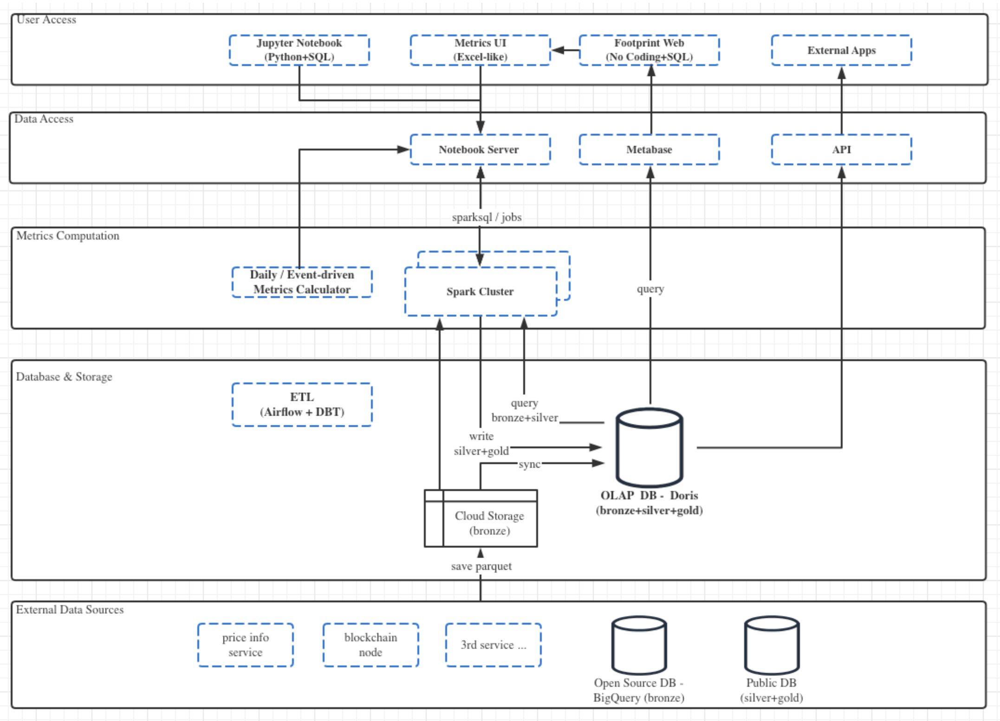

# Data access

Because of massive data and performance of data calculation, Footprint provides 4 interfaces for users:

### **Footprint Web App**

Silver and gold data are available.

Footprint provides a drag-and-drop experience with no coding for analysts without SQL skills. And Footprint also provides SQL to make queries.

### **Metrics UI (Alpha)**

Silver Data is available.

There's no coding skill required. Excel-like experience enables users to make data processes quickly and easier to use.

Based on Python and Pandas.

Currently still in Alpha version.

### **Jupyter Notebook (Beta)**

Bronze and silver data are available.

You can use Python and Sql to make queries in Jupyter Notebook.

You can apply for a free trial by directly messaging admin in [Discord.](https://discord.com/invite/3HYaR6USM7)

### **Data API (Beta)**

Footprint provides a Data API and gets access to more chains in different domains.

You can directly message admin in [Discord](https://discord.com/invite/3HYaR6USM7) to get more information and pricing plans.
