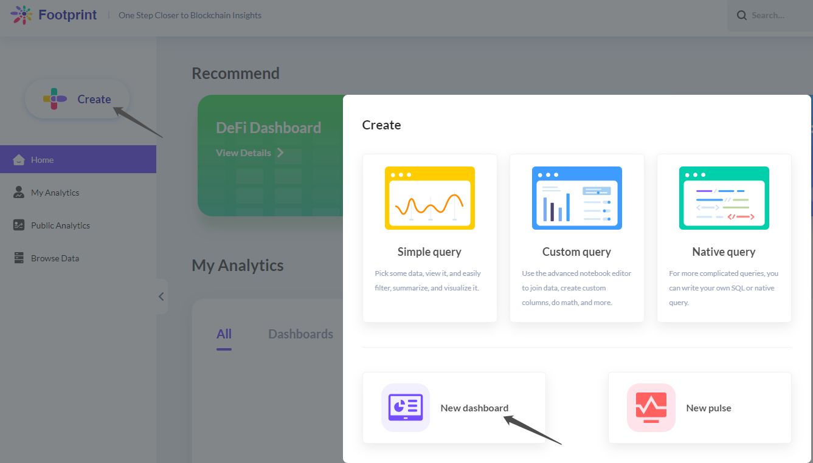

# How to create a dashboard

.png>)

Data shown in the Dex dashboard data is simply from the table **Dex Daily Stats**, showing:

* Dex daily volume of each chain
* The percentage of Dex daily volume of each chain
* The distribution of latest Dex volume by DApp
* Dex daily volume by DApp
* Dex daily trade count by DApp

1\. Click on the **Footprint** icon in the upper left corner, then click on “**Create**”, here we select **New dashboard**. You can choose the folder you want to save your dashboard.

.png>)

2\. To make your dashboard editable, click on **Edit dashboard** in the upper right corner to begin editing.

.png>)

3\. Click and **Add questions** to display the questions you want to present.

.png>)

4\. After that, you will get the charts that can be added, and you can also edit the position and size.

.png>)

5\. Click on **Visualization options** (the top right corner of the chart) for detailed editing

.png>)

6\. You can modify settings such as Display, Axes, Labels, etc.

.png>)

**7. Add series** allows you to add another question for comparison.

.png>)

.png>)

8\. For multiple questions, you can add a filter linkage. Click on **add a filter on the top right corner**, and select the type of filter you would like. You can choose **time, location, id, and other categories**.

.png>)

9\. Select the question you need to associate with and set the Default Value.

.png>)

10\. Once you finished the editing,  click the "Save" bottom.
