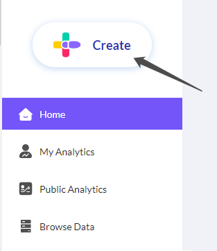
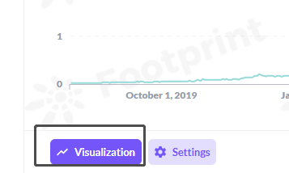
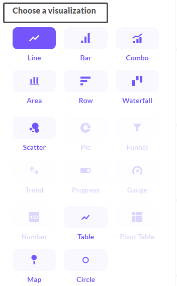
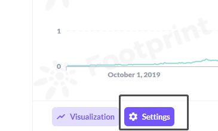
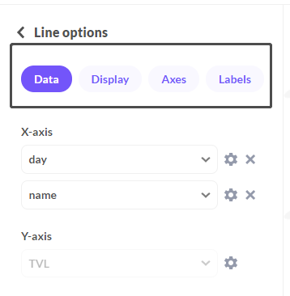
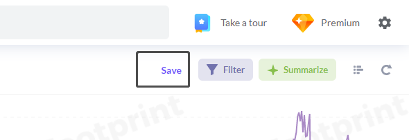
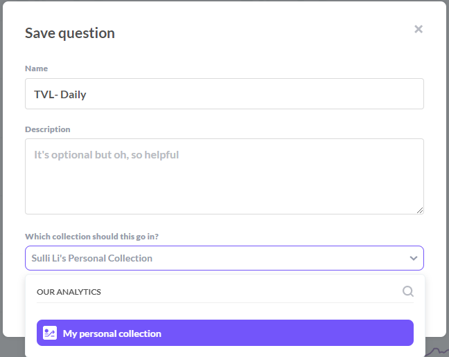

# How to create your first analysis chart

1. **Click the “Create” button**

**2. Choose the type of query**

* Simple query: use just one data table to create a chart
* Custom query: use multiple data tables by joining to create a chart
* Native query: for advanced users, make your own data table by writing SQL queries

.png>)

&#x20;                                             &#x20;

**3. Choose the Footprint table and pick your starting data**

.png>) .png>)

**4. To find the data you need, you can:**

A. check through the table name (eg: if you want to do the analysis of Pair, you can click the data of "DEX Pair Daily Stats" ); or

B. check the fields contained inside the table

* pick a table and enter the edit page
* click the triangle button representing Preview
* check if you need this table to contain the fields
* If no, back to the step “ⅰ”, choose another table to find your field (or you can raise your question on our discord)

.png>)

.png>)

&#x20;**5. Edit and filter the data**

* Data: the table you are now using
* Join data: join multiple tables for advanced queries
* Filter: filter the fields you need
* Summarize: create a new field by summarizing data in different ways by the selected dimension
* Sort: sort the table by ascending or descending
* Row limit: you can limit the row of your result
* Visualize: visualize your table into a chart

.png>)

**6. Table Visualization**

* Choose a visualization: pick the way to show your data (line, bar, combo, ..etc.)
* &#x20;Done

 

**7 Visualization Setting**

* Options (take line chart as an example)
  * Data: to rename the X & Y axis
  * Display: to set the chart display, such as the data from, chart colors etc.
  * Axes: to set the axes parameters
  * Labels: to set the label of the X & Y axis
* Done

 ****

**8. Save**

* Save question
  * Name: name your analysis chart
  * Description: make a description of your chart if any
  * select the Collection: choose the location you want to save your result
* Save

****

**9. Shortcut to create a dashboard**

* Yes please: You can immediately add your saved analysis into a dashboard by clicking ‘Yes Please’, or
* Not now: create the dashboard later when all charts are done

