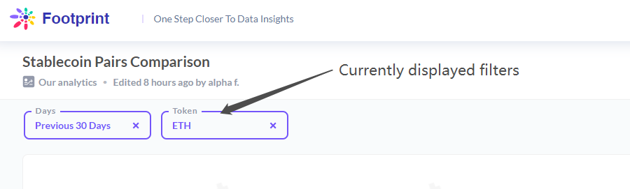

# How to read a Footprint dashboard

1. Click the dashboard you are interested in according to the name on the Home page - Recommend\

2. Know the components of the dashboard
   * Know what the chart shows by the chart name
   * Know the description of different charts (Move the mouse to the name of the charts to get the description)
   * Know what the X-axis, Y-axis, and legend of the charts means\

3. Find out what is currently displayed in the dashboard filters. You can click the filter, input the name of tokens or the name of chains according to the type of filter you want to know.

