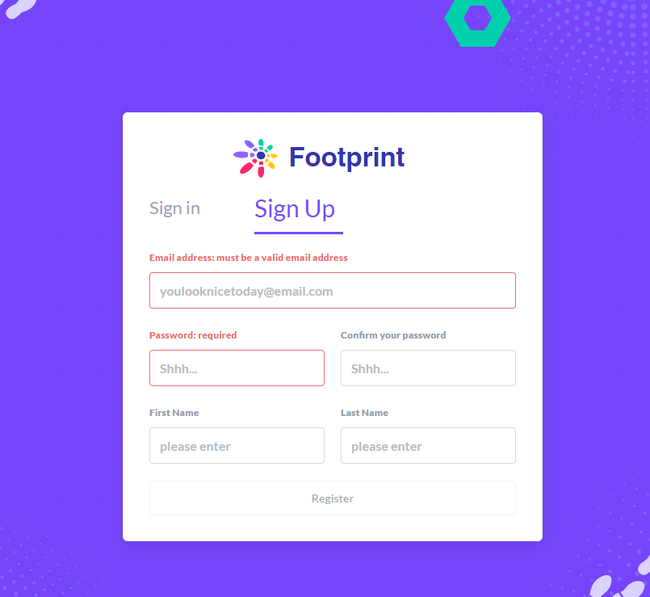
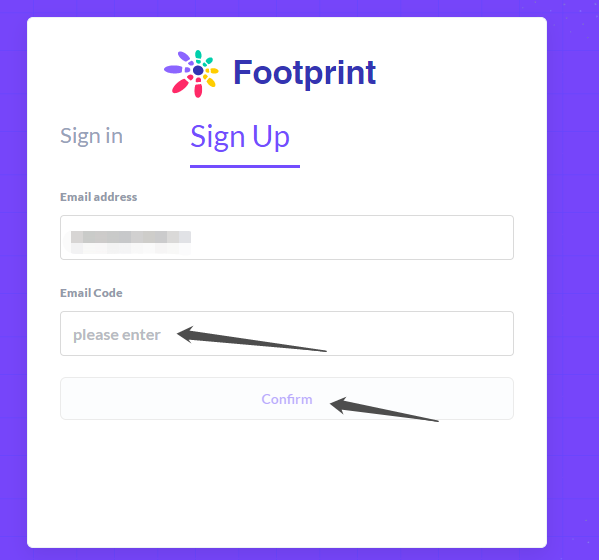
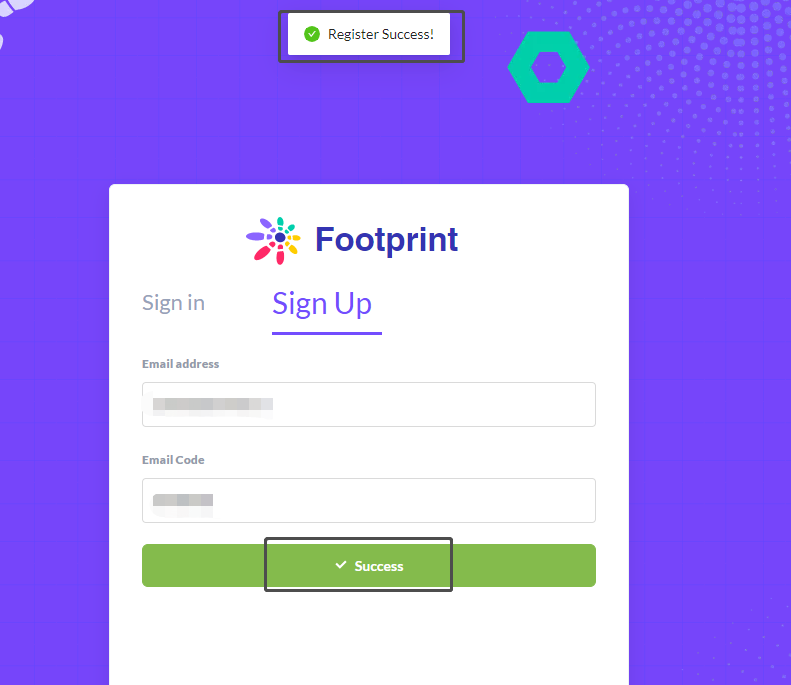
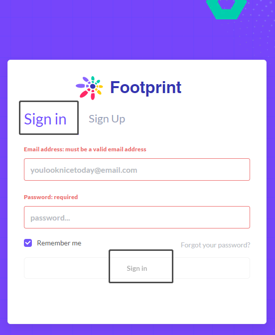

# How to sign up for a Footprint account

1\. Open the registration [website](https://www.footprint.network) and select "Sign up", click “Register” after filling in the information required (email, password, name)

2\. Enter the "Email Code" sent to your registered email address, then click "Confirm".

C. After receiving the register success reminder, you can click "Sign in" to enter the login page, fill in the email address and password required for login, and click “Sign in” below to enter the main page.

PS: To facilitate the next entry, select “Remember me” to remember the password, so you can quickly enter the main page next time.

 

****
