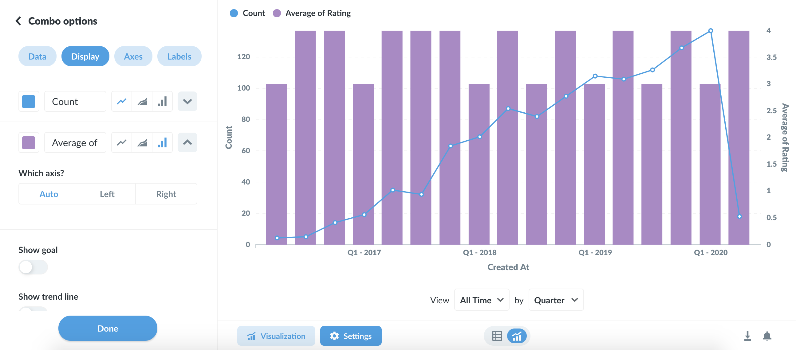

# Combo chart

It will pick one of your series to display as a line, and another to display as a bar by default. Open up the visualization settings to change which series are lines, bars, or areas, as well as to change per-series settings like colors. Click the down arrow icon on the right of a series to see additional options:

To use a combo chart you’ll either need to have two or more metrics selected in the Summarize By section of your question, with one or two grouping columns, like this:

.png>)

Or, you’ll need a question with a single metric and two grouping columns, like this:

.png>)
