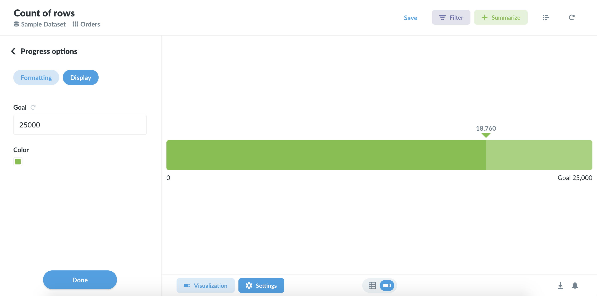

# Progress bars

**Progress bars** are for comparing a single number to a goal value that you set. Open up the settings for your progress bar to choose a value for your goal, and Metabase will show you how far away your question’s current result is from the goal.

