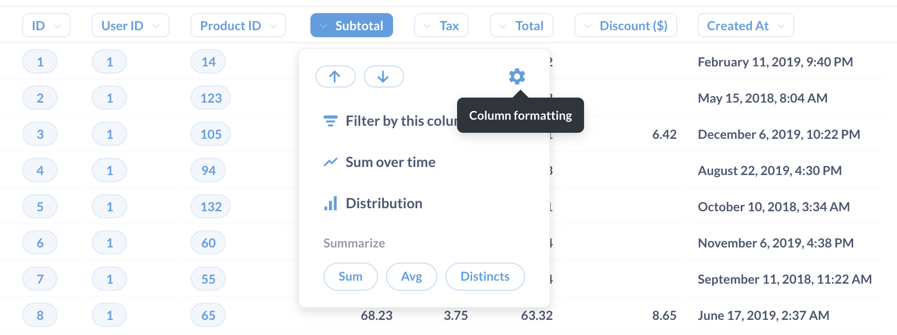

# Table

The Table option is good for looking at tabular data, or for lists of things like users or orders. The visualization options for tables allow you to add, hide, or rearrange fields in the table you’re looking at, as well as modify their formatting. Check out everything you can do with the table visualization.

Rearranging, adding, and removing columns

Open up the settings for your table and you’ll see the Columns tab, which displays all the columns currently being shown in the table. Below that you’ll see a list of more columns from linked tables, if any, that you can add to the current table view.

To hide a column, click the X icon on it; that’ll send it down to the More columns area in case you want to bring it back. To add a linked column, just click the + icon on it, which will bring it to the Visible columns section. Click and drag any of the columns listed there to rearrange the order in which they appear. Another super easy way to rearrange columns without having to open up the visualization settings is to simply click and drag on a column’s heading to move it where you’d like it to go.

**Column formatting options**&#x20;

To format the display of any column in a table, click on the column heading and choose the Formatting option (you can also get there by clicking on the gear on any column when in the Columns tab of the visualization settings).

The options you see will differ depending on the type of column you’re viewing:
