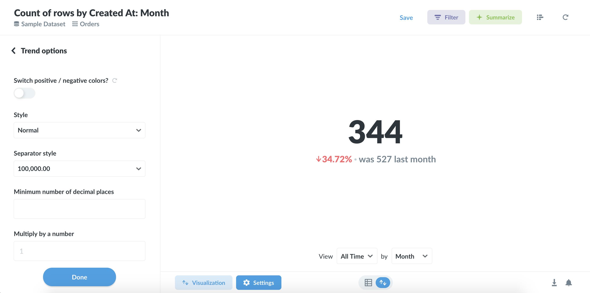

# Trend

Use this visualization, you’ll need to have a single number grouped by a Time field, like the Number of Orders by Created At. The Trend will show you the value of the number during the most recent period, as well as how much the number has increased or decreased compared to its value in the previous period. The period is determined by your group-by field; if you’re grouping by Day, the Trend will show you the most recent day compared to the previous day.

By default, Trends will display increases as green (i.e. “good”) and decreases as red (“bad”). If your number is something where an increase is bad and a decrease is good (such as Bounce Rate, or Costs), you can reverse this behavior in the visualization settings:

